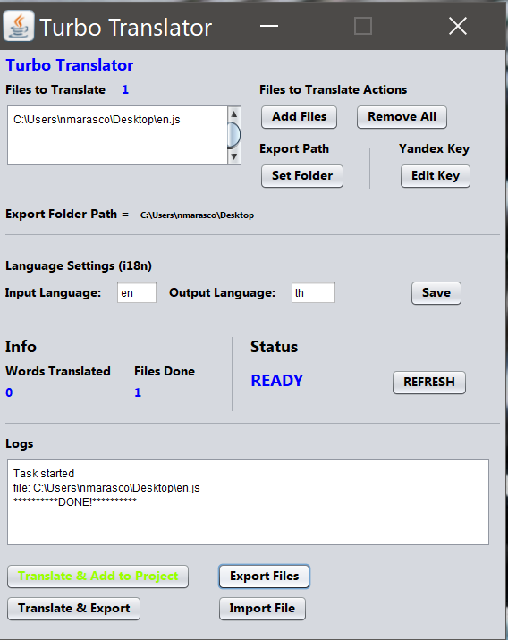

# TurboTranslator
TurboTranslator is a tool to export, auto translate and import to previous project.
It has been developed to speed up adding language process into a project.

## Supported OS
Right now TT supports Windows only. It's developed to support all Java-supported OS, it will be available soon on Linux and MacOs.

## Dependecies
* Apache POI library

# User Guide
This paragrapth explains how user can use TurboTranslator by GUI.

**Files to Translate**

Here you can see the path and total number of files that will be translated.
By **Add Files** you can add another path.
Selecting **Remove All** you will delete all selected path.

**Export Path**

It allow you to enter export path where file will be generated.

**Edit Key**

This button is used to enter the Yandex Key, it's mandatory if you want translate using this tool
If this field is empty, Auto translation buttons will be deactivated.

**Language Settings (i18n)**

Here you can decide the input language and output language.
The input will be used to name the second column of Excel File.
